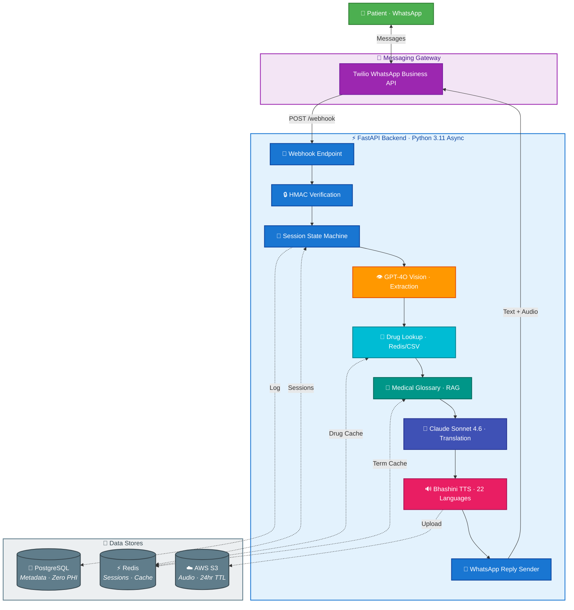

# SehatSamjho — AI Medical Document Translator

Patients photograph prescriptions on WhatsApp and receive plain-language translations with audio in their chosen Indian language.

## How It Works

```
Patient sends prescription photo via WhatsApp
  → GPT-4O Vision extracts medicines, dosages, instructions
  → Drug database enriches with purpose, side effects, interactions
  → Medical glossary grounds terminology in patient's language
  → Claude Sonnet 4.6 simplifies and translates to chosen language
  → Bhashini TTS generates audio summary
  → Patient receives text + audio reply on WhatsApp
```

## Architecture

### Processing Pipeline


### System Overview



## Tech Stack

| Layer | Technology |
|-------|------------|
| Messaging | Twilio WhatsApp Business API |
| Backend | Python 3.11 / FastAPI / uvicorn (async) |
| Vision / Extraction | OpenAI GPT-4O Vision |
| Translation | Anthropic Claude Sonnet 4.6 |
| TTS | Bhashini (22 Indian languages) |
| Database | PostgreSQL (async SQLAlchemy + asyncpg) |
| Cache / Sessions | Redis |
| Audio Storage | AWS S3 (presigned URLs, 24hr lifecycle) |
| Hosting | AWS EC2 t3.micro (ap-south-1) |

## Supported Languages

Hindi, Bengali, Tamil, Telugu, Marathi, Gujarati, Kannada, Malayalam, Odia, Punjabi, Assamese, Urdu, Kashmiri, Sindhi, Konkani, Maithili, Dogri, Manipuri, Santali, Nepali, Bodo, Sanskrit

## Local Setup

```bash
# 1. Create virtual environment
make venv
source .venv/bin/activate

# 2. Install dependencies (dev extras include pytest, ruff)
make install-dev

# 3. Copy and fill environment variables
cp .env.example .env
# Edit .env with your API keys

# 4. Run the dev server
make local-dev
# Server starts at http://localhost:8000

# 5. Verify health
curl http://localhost:8000/health
# {"status": "ok"}
```

## Environment Variables

| Variable | Description |
|----------|-------------|
| `OPENAI_API_KEY` | OpenAI API key (GPT-4O Vision extraction) |
| `ANTHROPIC_API_KEY` | Anthropic API key (Claude translation) |
| `TWILIO_ACCOUNT_SID` | Twilio account SID |
| `TWILIO_AUTH_TOKEN` | Twilio auth token |
| `TWILIO_WHATSAPP_FROM` | Twilio WhatsApp sender (e.g. `whatsapp:+14155238886`) |
| `BHASHINI_API_KEY` | Bhashini TTS API key |
| `BHASHINI_USER_ID` | Bhashini user ID |
| `AWS_ACCESS_KEY_ID` | AWS access key for S3 |
| `AWS_SECRET_ACCESS_KEY` | AWS secret key for S3 |
| `S3_BUCKET` | S3 bucket name for audio files |
| `DATABASE_URL` | PostgreSQL connection string |
| `REDIS_URL` | Redis connection string |

## Running Tests

```bash
# All tests
make local-test

# Specific test file
cd backend && python -m pytest tests/services/test_send_audio_message.py -v --tb=short
```

All external services (OpenAI, Anthropic, Bhashini, Twilio, Redis, DB) are fully mocked in tests.

## Linting

```bash
make local-lint
```

Uses Ruff with 100-char line length.

## Docker

```bash
# Local dev stack (app + PostgreSQL + Redis)
make dev

# Run tests in container
make test

# Run migrations
make migrate

# Seed drug database + glossary into Redis
make seed
```

## Project Structure

```
backend/app/
├── main.py              # FastAPI app factory + /health
├── api/
│   ├── webhooks.py      # Twilio WhatsApp webhook + state machine
│   └── dashboard.py     # B2B analytics endpoints
├── core/
│   ├── config.py        # pydantic-settings (all env vars)
│   └── security.py      # Twilio HMAC signature verification
├── db/
│   ├── database.py      # Async SQLAlchemy engine + session
│   ├── redis.py         # Async Redis client
│   └── models.py        # InteractionLog table (metadata only, zero PHI)
├── models/
│   └── schemas.py       # Pydantic request/response models
└── services/
    ├── whatsapp.py      # Language data + Twilio messaging helpers
    ├── extraction.py    # GPT-4O Vision → PrescriptionData
    ├── translation.py   # Claude Sonnet 4.6 translation + glossary RAG
    ├── tts.py           # Bhashini TTS → S3 audio
    ├── drug_lookup.py   # Redis/CSV/API drug enrichment
    └── glossary.py      # Medical glossary loader + Redis lookup
```

## Privacy

- Zero PHI (Protected Health Information) stored
- Phone numbers hashed (SHA-256) before logging
- No raw images, prescriptions, or patient data persisted
- Only metadata logged: timestamp, language, doc_type, latency, status
