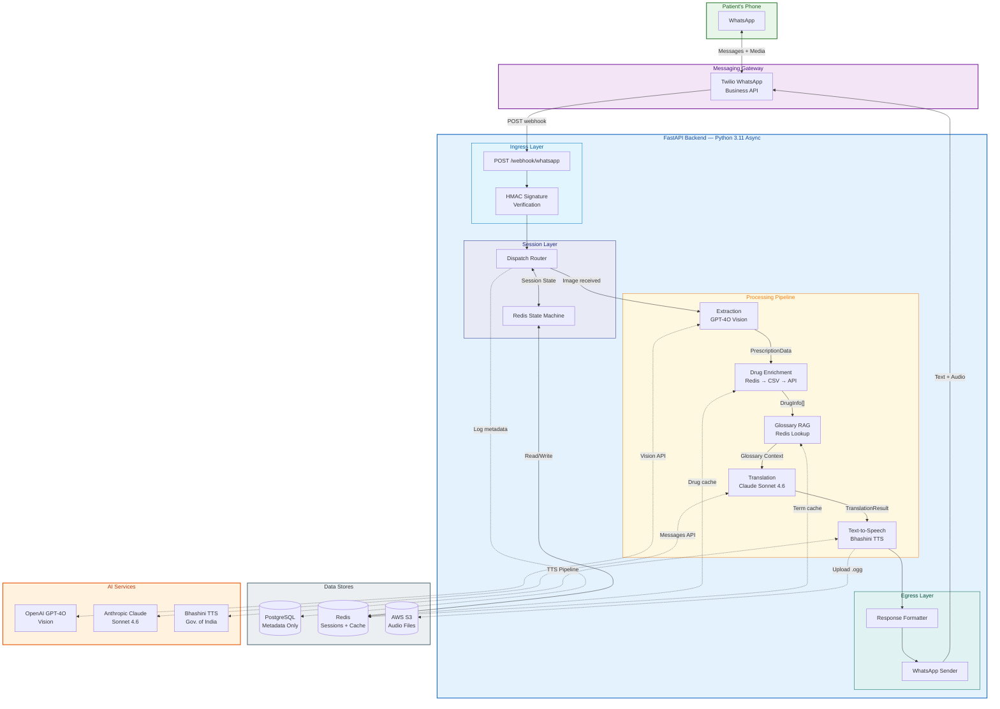
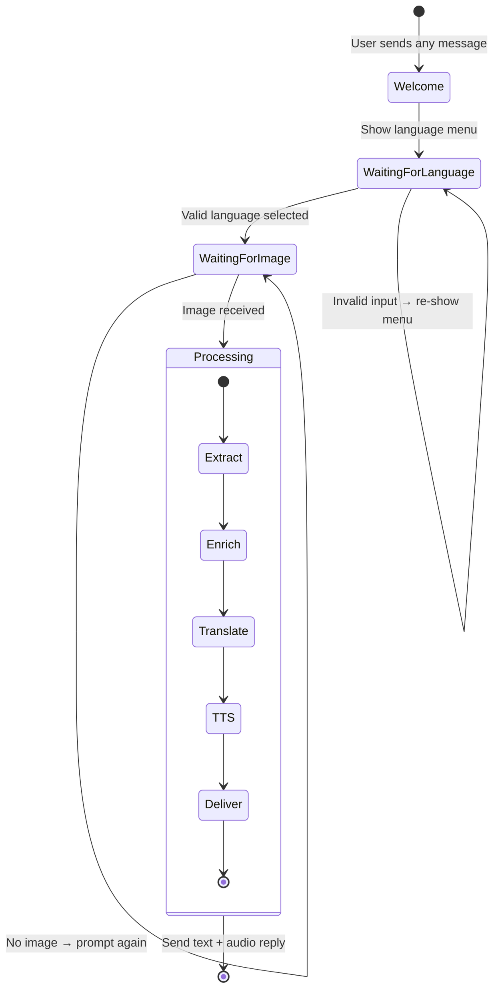

<p align="center">
  
  
  
  
  
  
</p>

# SehatSamjho

**AI-powered medical document translator for WhatsApp.**

Patients photograph their prescriptions on WhatsApp and receive a plain-language explanation with audio — in any of 22 Indian languages.

---

## The Problem

> 60% of Indian patients cannot read their own prescriptions. Language barriers, medical jargon, and illegible handwriting lead to medication errors, missed doses, and preventable harm — especially in rural areas where doctor visits are infrequent.

## The Solution

SehatSamjho turns any WhatsApp-connected phone into a personal prescription translator. No app downloads, no signup, no literacy required — just send a photo and listen.

```
Patient photographs prescription
    → AI extracts every medicine, dosage, and instruction
    → Drug database adds purpose, side effects, interactions
    → Medical glossary grounds terminology in patient's language
    → AI simplifies into plain language the patient understands
    → Text-to-speech generates an audio explanation
    → Patient receives text + audio on WhatsApp
```

---

## Architecture

### High-Level System Design



### Processing Pipeline — Step by Step


### WhatsApp Conversation Flow



---

## Tech Stack

| Layer | Technology | Role |
|-------|-----------|------|
| **Messaging** | Twilio WhatsApp Business API | Send/receive WhatsApp messages and media |
| **Backend** | Python 3.11 / FastAPI / uvicorn | Fully async request handling |
| **Vision AI** | OpenAI GPT-4O (`gpt-4o`) | Extract medicines, dosages, instructions from images |
| **Translation AI** | Anthropic Claude Sonnet 4.6 (`claude-sonnet-4-6`) | Simplify medical jargon + translate to patient's language |
| **Text-to-Speech** | Bhashini (Gov. of India) | 22 Indian language voices, free API |
| **Drug Database** | Local CSV (1000+ medicines) + Redis cache + API fallback | Sub-100ms drug lookups with enrichment |
| **Medical Glossary** | Per-language JSON (100 terms × 6 languages) + Redis | RAG context injection for accurate medical terminology |
| **Database** | PostgreSQL (async SQLAlchemy + asyncpg) | Metadata logging only — zero PHI |
| **Cache** | Redis | Session state, drug cache, glossary cache |
| **Audio Storage** | AWS S3 | Presigned URLs, auto-delete after 24 hours |
| **Hosting** | AWS EC2 t3.micro (ap-south-1) | Docker deployment, free tier eligible |
| **Migrations** | Alembic | Async-compatible schema management |

---

## Supported Languages

All 22 scheduled languages of India:

| | | | |
|---|---|---|---|
| Hindi | Bengali | Tamil | Telugu |
| Marathi | Gujarati | Kannada | Malayalam |
| Odia | Punjabi | Assamese | Urdu |
| Kashmiri | Sindhi | Konkani | Maithili |
| Dogri | Manipuri | Santali | Nepali |
| Bodo | Sanskrit | | |

---

## Project Structure

```
SehatSamjho/
├── backend/
│   ├── app/
│   │   ├── main.py                    # App factory, lifespan, /health
│   │   ├── api/
│   │   │   ├── webhooks.py            # WhatsApp webhook + state machine + pipeline
│   │   │   └── dashboard.py           # Analytics endpoints (stub)
│   │   ├── core/
│   │   │   ├── config.py              # pydantic-settings (12 env vars)
│   │   │   └── security.py            # Twilio HMAC signature verification
│   │   ├── db/
│   │   │   ├── database.py            # Async SQLAlchemy engine + session factory
│   │   │   ├── redis.py               # Async Redis client + connection pool
│   │   │   └── models.py              # InteractionLog table (metadata, zero PHI)
│   │   ├── models/
│   │   │   └── schemas.py             # 8 Pydantic models (request/response)
│   │   └── services/
│   │       ├── extraction.py          # GPT-4O Vision → PrescriptionData
│   │       ├── translation.py         # Claude Sonnet 4.6 → TranslationResult
│   │       ├── tts.py                 # Bhashini TTS → S3 audio → presigned URL
│   │       ├── drug_lookup.py         # Redis/CSV/API → DrugInfo enrichment
│   │       ├── glossary.py            # Medical glossary loader + Redis RAG
│   │       └── whatsapp.py            # Language data + Twilio messaging helpers
│   ├── scripts/
│   │   └── seed.py                    # Load drugs + glossary into Redis
│   ├── alembic/                       # Database migrations
│   ├── tests/                         # 1264 tests, 100% mocked externals
│   └── Dockerfile                     # Multi-stage (base/dev/prod)
├── data/
│   ├── drugs/medicines.csv            # 1001 Indian medicines
│   └── glossary/{hi,ta,te,kn,bn,mr}.json  # 100 terms × 6 languages
├── docker-compose.yml                 # Local dev (app + postgres + redis)
├── docker-compose.prod.yml            # Production overrides
├── pyproject.toml                     # Single source of truth for deps
├── Makefile                           # 11 developer commands
└── .env.example                       # All 12 required env vars
```

---

## Getting Started

### Prerequisites

- Python 3.11+
- [uv](https://docs.astral.sh/uv/) package manager
- API keys: OpenAI, Anthropic, Twilio, Bhashini, AWS

### Local Setup

```bash
# 1. Clone and enter
git clone https://github.com/nishantgaurav23/SehatSamjho.git
cd SehatSamjho

# 2. Create virtual environment
make venv
source .venv/bin/activate

# 3. Install dependencies (includes dev tools: pytest, ruff)
make install-dev

# 4. Configure environment
cp .env.example .env
# Edit .env with your API keys

# 5. Start the dev server
make local-dev
# → http://localhost:8000

# 6. Verify
curl http://localhost:8000/health
# {"status": "ok"}
```

### Docker Setup

```bash
# Full local stack (app + PostgreSQL + Redis)
make dev

# Run database migrations
make migrate

# Seed drug database + glossary into Redis
make seed

# Run tests inside container
make test
```

---

## Environment Variables

| Variable | Description |
|----------|-------------|
| `OPENAI_API_KEY` | OpenAI API key (GPT-4O Vision extraction) |
| `ANTHROPIC_API_KEY` | Anthropic API key (Claude translation) |
| `TWILIO_ACCOUNT_SID` | Twilio account SID |
| `TWILIO_AUTH_TOKEN` | Twilio auth token |
| `TWILIO_WHATSAPP_FROM` | Twilio WhatsApp sender (`whatsapp:+14155238886`) |
| `BHASHINI_API_KEY` | Bhashini TTS API key |
| `BHASHINI_USER_ID` | Bhashini user ID |
| `AWS_ACCESS_KEY_ID` | AWS access key for S3 |
| `AWS_SECRET_ACCESS_KEY` | AWS secret key for S3 |
| `S3_BUCKET` | S3 bucket name for audio files |
| `DATABASE_URL` | PostgreSQL connection string |
| `REDIS_URL` | Redis connection string |

---

## Testing

```bash
# Run all 1264 tests
make local-test

# Run a specific test file
cd backend && python -m pytest tests/services/test_extraction_errors.py -v --tb=short

# Run tests by keyword
cd backend && python -m pytest tests/ -k "glossary" -v --tb=short
```

All external services are fully mocked — no API keys needed to run tests.

| Test Area | Files | Tests |
|-----------|-------|-------|
| API / Webhooks / Pipeline | 12 | 240 |
| Services (extraction, translation, TTS, drugs, glossary, WhatsApp) | 27 | 644 |
| Data Layer (DB, Redis, models, schemas) | 5 | 95 |
| Data Files (CSV, JSON validation) | 4 | 173 |
| Infrastructure (Dockerfile, Compose, migrations) | 7 | 112 |
| **Total** | **55** | **1264** |

---

## Linting

```bash
make local-lint
```

Ruff with 100-character line length. Checks formatting and lint rules in one pass.

---

## Privacy and Security

| Principle | Implementation |
|-----------|---------------|
| **Zero PHI storage** | No raw images, prescriptions, or patient data persisted anywhere |
| **Phone hashing** | Phone numbers SHA-256 hashed before any logging |
| **Metadata-only logs** | Only: timestamp, language, doc_type, latency, status, error_code |
| **HMAC verification** | Every webhook validated via Twilio HMAC signature |
| **Ephemeral audio** | S3 audio files auto-deleted after 24 hours |
| **No hardcoded secrets** | All API keys via `.env` → pydantic-settings |
| **Transient sessions** | Redis sessions expire after 30 minutes |

---

## Development Progress

Built using spec-driven development (TDD). Each spec has a dedicated folder under `specs/` with a detailed specification and implementation checklist.

| Phase | Name | Specs | Status |
|-------|------|-------|--------|
| 1 | Project Setup | S1.1 – S1.5 | Done |
| 2 | Data Layer | S2.1 – S2.5 | Done |
| 3 | WhatsApp Channel | S3.1 – S3.5 | Done |
| 4 | Webhook State Machine | S4.1 – S4.6 | Done |
| 5 | GPT-4O Vision Extraction | S5.1 – S5.5 | Done |
| 6 | Medical Glossary | S6.1 – S6.4 | Done |
| 7 | Translation | S7.1 – S7.5 | Done |
| 8 | Drug Lookup | S8.1 – S8.5 | Done |
| 9 | TTS & Audio Delivery | S9.1 – S9.5 | Done |
| 10 | Pipeline Integration | S10.1 – S10.5 | Done |
| 11 | Infra & Seeding | S11.1 – S11.7 | Done |
| 12 | AWS Deployment | S12.1 – S12.7 | Pending |
| 13 | QA & Handover | S13.1 – S13.5 | Pending |

**57 / 69 specs complete** — core application fully built, deployment phase next.

---

## Cost Estimate (Prototype)

| Resource | Monthly Cost |
|----------|-------------|
| EC2 t3.micro | $0 (free tier) |
| RDS db.t3.micro PostgreSQL | $0 (free tier) |
| S3 audio storage | $0 (free tier) |
| Upstash Redis | $0 (free tier) |
| OpenAI GPT-4O Vision | ~$5 / 1000 documents |
| Claude Sonnet 4.6 | ~$2 / 1000 documents |
| Twilio WhatsApp | ~$1–5 during testing |
| **Total** | **~$8–15/month** |

---

## License

MIT
