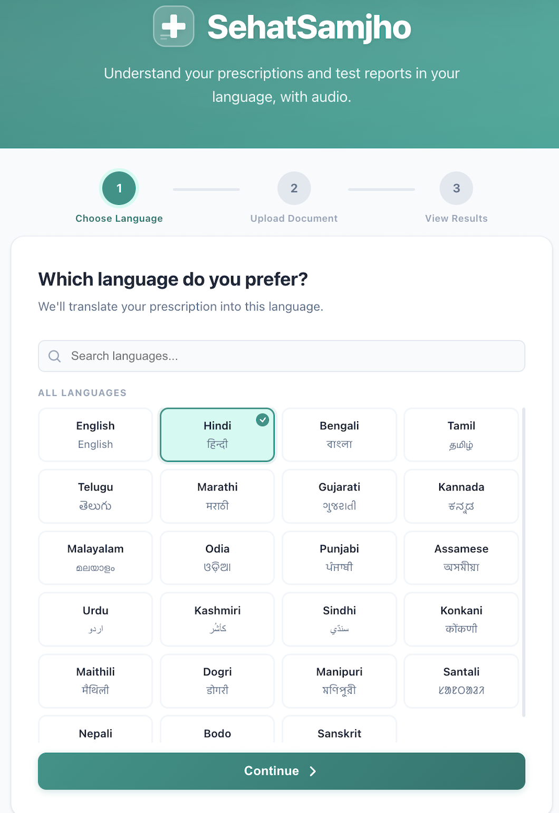
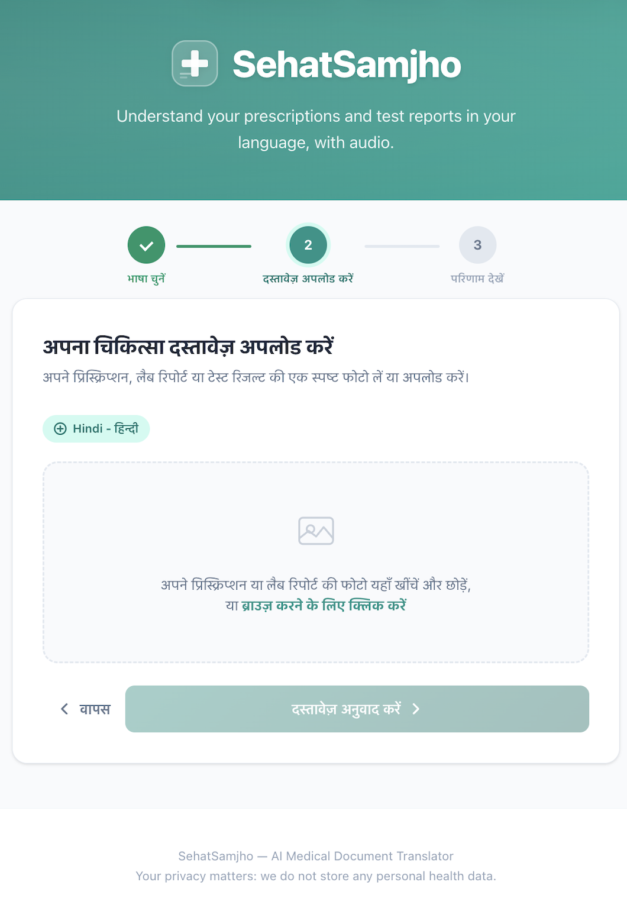
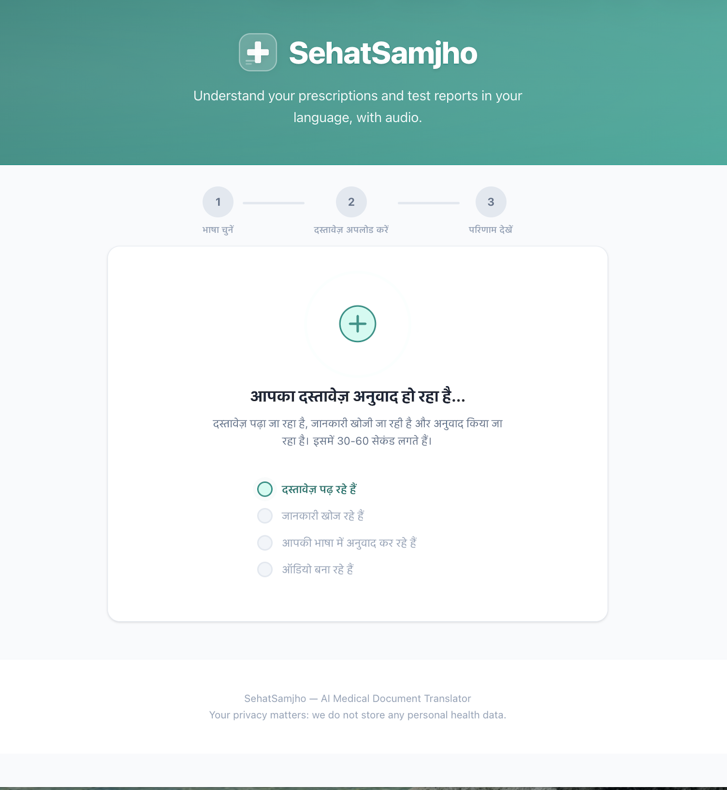
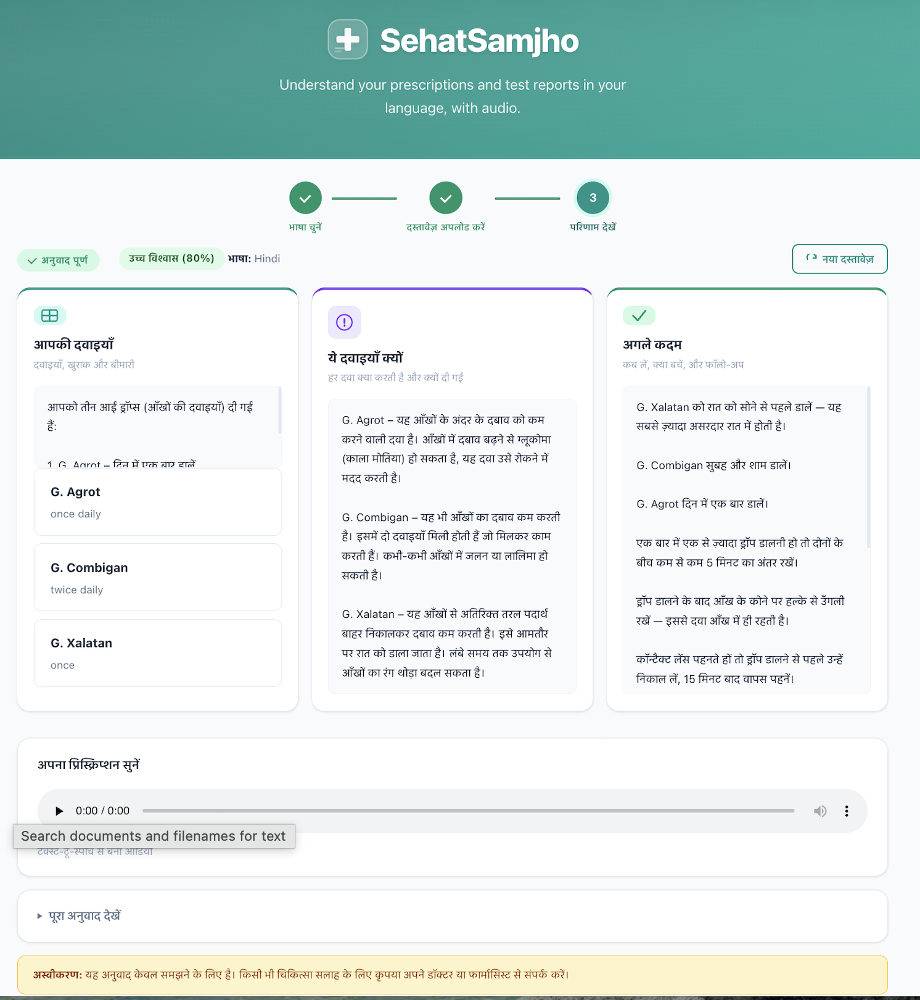
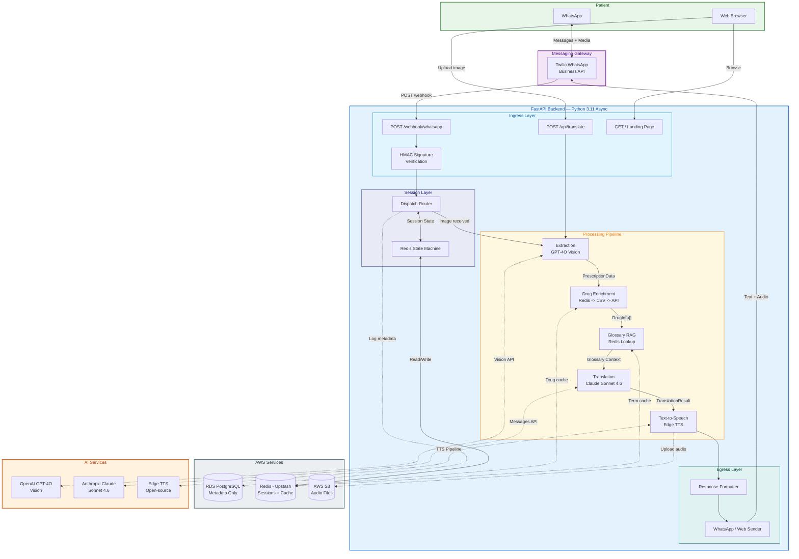

<p align="center">
  
  
  
  
  
  
  
</p>

# SehatSamjho

**AI-Powered Prescription Translator — Plain Language + Audio in 23 Indian Languages via WhatsApp & Web**

> Transforming Healthcare Access for 1.4 Billion Indians

Patients photograph their prescriptions on WhatsApp or upload them on the web — and receive a plain-language explanation with audio in any of 23 Indian languages. No app downloads, no signup, no literacy required — just send a photo and listen.

---

## The Problem

> **60% of Indian patients cannot read their own prescriptions.** Language barriers, medical jargon, and illegible handwriting lead to medication errors, missed doses, and preventable harm — especially in rural areas where doctor visits are infrequent.

| Challenge | Description |
|-----------|-------------|
| **Language Barriers** | Prescriptions written in English, patients speak 22+ languages |
| **Medical Jargon** | BD, TDS, SOS — abbreviations patients don't understand |
| **Illegible Handwriting** | Doctor's handwriting often impossible to read |

**Dangerous Consequences:** Medication errors, missed doses, preventable harm — especially in rural areas where doctor visits are infrequent.

## The Solution

SehatSamjho turns any computer or WhatsApp-connected phone into a personal prescription translator.

```
Patient photographs prescription
    -> AI extracts every medicine, dosage, and instruction (GPT-4O Vision)
    -> 1,001-medicine database adds purpose, side effects, interactions
    -> Medical glossary grounds terminology in patient's language
    -> AI simplifies into plain language the patient understands (Claude Sonnet 4.6)
    -> Text-to-speech generates an audio explanation (Edge TTS)
    -> Patient receives text + audio on WhatsApp or Web
```

| Metric | Value |
|--------|-------|
| Total Pipeline Time | ~30-60 seconds |
| Languages Supported | 23 |
| Medicines in Database | 1,001 |
| Tests Passing | 1,467 (100% pass rate) |
| Test-to-Code Ratio | 4.86:1 |

---

## Web Interface — Live Demo

The web platform is fully operational with drag-and-drop upload, 23-language support, structured medicine cards, and an inline audio player.

### Step 1: Choose Language

Select from all 23 scheduled Indian languages with a searchable grid.

<p align="center">
  
</p>

### Step 2: Upload Document

Upload your prescription, lab report, or test result — drag-and-drop or browse. The entire UI is translated to your selected language.

<p align="center">
  
</p>

### Processing

The pipeline reads your document, looks up drug information, translates to your language, and generates audio — all in 30-60 seconds.

<p align="center">
  
</p>

### Step 3: View Results

Structured results with three cards — **Your Medicines** (names, dosages), **Why These Medicines** (purpose and side effects), and **Next Steps** (timing and instructions). Includes an inline audio player and confidence scoring.

<p align="center">
  
</p>

---

## How It Works — End-to-End Pipeline

From photo to plain-language explanation in ~30-60 seconds:

| Step | Action | Technology |
|------|--------|------------|
| **1. Capture** | Patient photographs prescription using phone camera | Photo Input |
| **2. Extract** | Structure data with confidence scoring | GPT-4O Vision |
| **3. Enrich** | 1,001-medicine database adds context and details | Drug DB + Redis Cache |
| **4. Translate** | Medical RAG + plain-language simplification | Claude Sonnet 4.6 |
| **5. Deliver** | Text + Audio via WhatsApp or Web interface | Edge TTS |

### Processing Pipeline


### WhatsApp User Journey

```
Patient                          SehatSamjho Bot
  |                                    |
  |  [Sends prescription photo]  ----> |
  |                                    |
  | <---- "Select language:"           |
  |        1. Hindi  2. Bengali        |
  |        3. Tamil  4. More...        |
  |                                    |
  |  "1"  ---->                        |
  |                                    |
  | <---- "Hindi selected!"            |
  | <---- [Plain-language explanation]  |
  | <---- [Voice message - 0:25]       |
```

> **500M+ WhatsApp users in India** — meet patients where they already are.

---

## System Architecture



---

## Technology Stack

### AI Layer — Intelligence Core

| Technology | Role |
|-----------|------|
| **GPT-4O Vision** | Prescription image to structured JSON with confidence scoring. Reads handwritten and printed prescriptions. |
| **Claude Sonnet 4.6** | Medical jargon simplification + multilingual translation with RAG |

### Voice Layer — Audio Delivery

| Technology | Role |
|-----------|------|
| **Edge TTS** | Open-source TTS engine for voice synthesis (10 Indian languages, free, no API key) |
| **Audio Pipeline** | Real-time synthesis with S3 storage and 24-hour lifecycle |

### Backend — API & Processing

| Technology | Role |
|-----------|------|
| **FastAPI + Python 3.11** | Fully async high-performance API server (Docker) |
| **Pipeline Orchestrator** | Async, semaphore-controlled, with retry logic |

### Cloud Infrastructure — AWS Services

| Resource | Type | Tier |
|----------|------|------|
| **EC2** | t3.micro (ap-south-1) | Free tier |
| **RDS PostgreSQL** | db.t3.large | Metadata only |
| **S3** | Audio storage | 24-hour lifecycle |
| **Redis (Upstash)** | Session & cache | Free tier |
| **Elastic IP** | Static IP | Free when attached |

---

## Supported Languages

All 23 Indian languages:

| | | | |
|---|---|---|---|
| English | Hindi | Bengali | Tamil |
| Telugu | Marathi | Gujarati | Kannada |
| Malayalam | Odia | Punjabi | Assamese |
| Urdu | Kashmiri | Sindhi | Konkani |
| Maithili | Dogri | Manipuri | Santali |
| Nepali | Bodo | Sanskrit | |

---

## Privacy & Security

| Principle | Implementation |
|-----------|---------------|
| **Zero PHI Storage** | No raw images, prescriptions, or patient data persisted anywhere |
| **Phone Hashing** | Phone numbers SHA-256 hashed before any logging |
| **Metadata-Only Logs** | Only: timestamp, language, doc_type, latency, status, error_code |
| **HMAC Verification** | Every webhook validated via Twilio HMAC signature |
| **Ephemeral Audio** | S3 audio files auto-deleted after 24 hours |
| **No Hardcoded Secrets** | All API keys via `.env` -> pydantic-settings |
| **DISHA-Ready** | Compliant with India's digital health standards |
| **IAM + Elastic IP** | Least privilege access with static IP |

---

## Prototype Status

| Component | Status | Details |
|-----------|--------|---------|
| **Web UI** | Live | Drag-and-drop upload, 23 languages, medicine cards, inline audio player |
| **AI Pipeline** | Live | GPT-4O Vision extraction, Claude translation, Edge TTS — end-to-end tested |
| **Drug Database** | Live | 1,001 medicines, 49 therapeutic classes, Redis-cached, <100ms response |
| **WhatsApp Integration** | In Progress | Twilio webhook handler built, message parsing complete, delivery integration ongoing |
| **Health Endpoint** | Live | `GET /health` — real-time system monitoring |
| **Test Suite** | Live | 1,467 tests, 100% passing, 4.86:1 test-to-code ratio |

---

## Cost Estimate (Prototype)

| Resource | Monthly Cost |
|----------|-------------|
| EC2 t3.micro | $0 (free tier) |
| RDS PostgreSQL | $0 (free tier) |
| S3 audio storage | $0 (free tier) |
| Upstash Redis | $0 (free tier) |
| Edge TTS (Open-source) | $0 (free, no API key) |
| OpenAI GPT-4O Vision | ~$5 / 1,000 documents |
| Claude Sonnet 4.6 | ~$2 / 1,000 documents |
| Twilio WhatsApp | ~$1-5 during testing |
| **Total** | **~$8-15/month** |

---

## What's Next — Future Development

| Feature | Status | Description |
|---------|--------|-------------|
| **Twilio WhatsApp Live** | In Progress | Complete WhatsApp Business API integration |
| **ABDM Integration** | Planned | Connect with Ayushman Bharat Digital Mission for verified digital prescriptions |
| **Lab Report Translation** | Already Done | Blood test results, X-ray reports, discharge summaries |
| **B2B Analytics Dashboard** | Planned | React dashboard for hospitals and pharmacies with usage analytics |
| **Bhashini TTS** | Planned | Government-backed TTS for 22 languages |
| **PDF Extraction** | Planned | Support for PDF document uploads |
| **Multi-page Support** | Planned | Handle multiple prescription pages |
| **Doctor Verification** | Planned | Prescription validation loop |
| **Mobile App** | Planned | Native iOS and Android apps |

---

## Team

| Role | Name |
|------|------|
| **Team Leader** | Nishant Gaurav |
| **Team Name** | SehatSamjho |

Built for the **AWS AI for Bharat Hackathon 2025**.

---

## License

MIT
